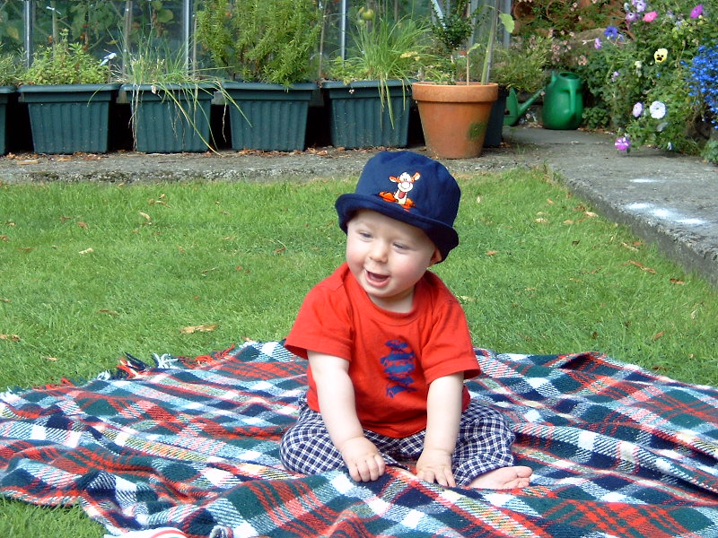





  <!-- Indicators -->
  <ol class="carousel-indicators">
    <li data-target="#myCarousel" data-slide-to="0" class="active"></li>
    <li data-target="#myCarousel" data-slide-to="1"></li>
    <li data-target="#myCarousel" data-slide-to="2"></li>
  </ol>

  <!-- Wrapper for slides -->
  

    

      
        

          <h3>On A Rug</h3>
        
Visiting Nana &amp; Papa

      

    

    

      
        

          <h3>Shades</h3>
        
LA is always so much fun!

      

    

    

      
        

          <h3>Cheeky</h3>
        
Dude

      

    

  

  <!-- Left and right controls -->
  <a class="left carousel-control" href="#myCarousel" data-slide="prev">
    
    Previous
  </a>
  <a class="right carousel-control" href="#myCarousel" data-slide="next">
    
    Next
  </a>

