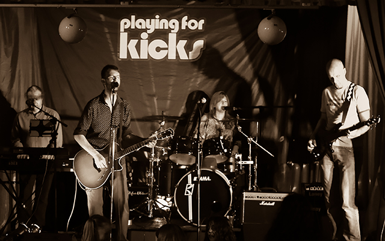





  <!-- Indicators -->
  <ol class="carousel-indicators">
    <li data-target="#myCarousel" data-slide-to="0" class="active"></li>
    <li data-target="#myCarousel" data-slide-to="1"></li>
    <li data-target="#myCarousel" data-slide-to="2"></li>
  </ol>

  <!-- Wrapper for slides -->
  

    

      
        

          <h3>The New Inn, Wilsden - November 2015</h3>
        
After a bit of a break it was great to be back at the New Inn in Wilsden. A great crowd turned up to see Dave's final public appearance with us as Bass Player, along with a special guest Landlord on drums.

      

    

    

      
        

          <h3>Ryshworth Club, Bingley, December 2016</h3>
        
Complete with special guest bassist, Chris Gates, we played at a fundraiser following on from our Calais and Clowns Without Borders events earlier in the year. This time the funds raised went to provide much needed essentials for those sleeping on the streets of Calais.

      

    

    

      
        

          <h3>Shipley Social Club, July 2016</h3>
        
Following on from our Calais Fundraiser earlier in the year, we felt it was important to raise more money to help send Clowns Without Borders to the refugee camps in France. There, they work hard to distract those in the camps from the appalling conditions around them.

      

    

  

  <!-- Left and right controls -->
  <a class="left carousel-control" href="#myCarousel" data-slide="prev">
    
    Previous
  </a>
  <a class="right carousel-control" href="#myCarousel" data-slide="next">
    
    Next
  </a>

